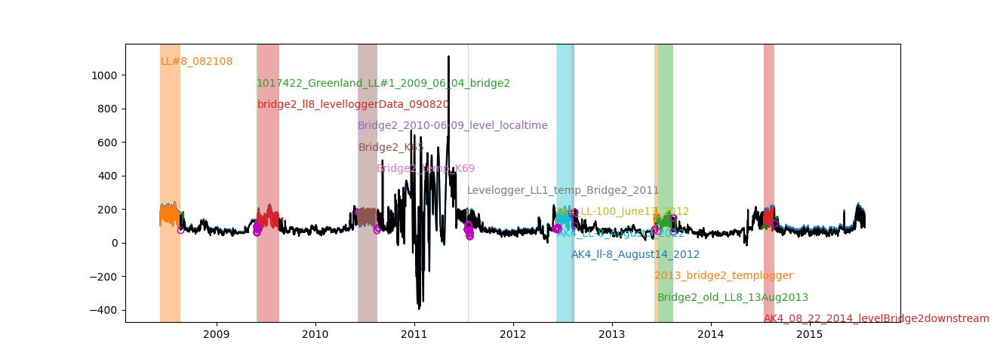
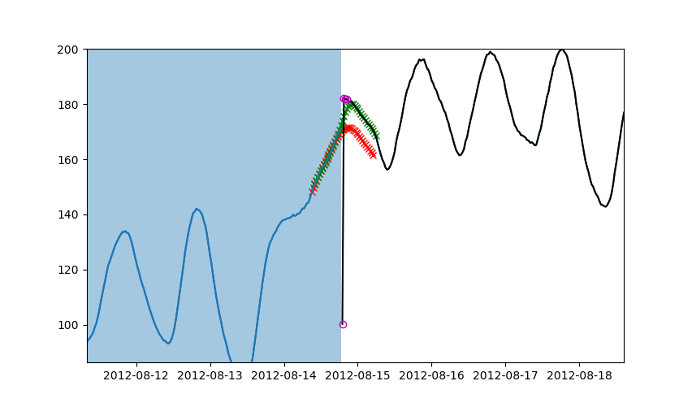
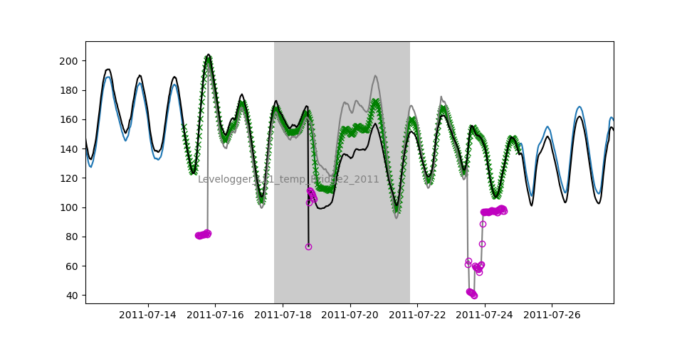

Technical Aspects
-----------------

The concatenation follows the following steps:

#. The csv files are read in and placed in a :class:`~pandas.DataFrame` attached to the :class:`.Reader` as :attr:`~.Reader.data`. This is handled by :mod:`kangeroo.core`, while everything that follows below is contained in :mod:`kangeroo.concat`.

#. The individual time series (columns in the :class:`~pandas.DataFrame` :attr:`~.Reader.data`) are sorted into 'long' and 'short' ones based on a length threshold, in :meth:`~.Concatenator.organize_time`. The default threshold is 100 days. Only 'short' time series will later be adjusted by a potential additive offset.

#. A distance measure is computed in time which corresponds to the temporal gap or overlap between any two timeseries. An overlap has negative distance. The :func:`Dijkstra <scipy.sparse.csgraph.dijkstra>` algorithm is then used to find the path through this graph which prefers the largest overlaps.

#. An attempt is being made to detect which of the time series were collected with a wrong time zone setting. To improve the changes of success, it is assumed that there are two contiguous blocks within wich the setting is the same. The detection is based on computing the phase of the daily cycle, in :meth:`.phase`, by means of a trigonometric projection, and fitting of a :class:`~sklearn.tree.DecisionTreeRegressor`, in :meth:`time_zone`.

#. The original time series are resampled using the :meth:`pandas.DataFrame.resample` method, currently at a 30 min interval.

#. If there are overlapping timeseries where the removal of one series results in two others being separated only by a time less than a certain threshold (param ``dispensable_thresh`` in the :class:`.Concatenator` constructor, default 3600 seconds), **and** if this 'dispensable' time series is labeled as on outlier by a test checking its mean and standard deviation, that series is removed in :meth:`.pre_screen` before any further processing is undertaken.

#. A pass over all remaining time series is performed and relative additive offsets are computed, together with some auxiliary statistics. The focus is on the 'joins' between the time series, which either consists of a period of overlapping measurements or a flush connection or gap. Different procedures apply to these two respective types of connection, as detailed in the following two sections.

#. Consecutive joins of 'short' time series surrounded by 'long' ones are offset together and relative to the 'long' ones which are treated as correct, save for potential outliers at first or last few data points. This implies that the cumulative additive offsets of a such a sequences of 'short' series should sum to 0; in reality, there is usually a residual error. This error is distributed among the intermediate joins according to a measure of confidence in the offset calculations: If an offset is deemed to be calculated with higher confidence than another one, it receives correspondingly less of the total correction amount. The measure of confidence currently adopted is the standard deviation of the offset estimate as given by the standard rule of thumb :math:`\sigma / \sqrt{n}`, where :math:`\sigma` is the standard deviation of either the difference between cuncurrent data points in the case of overlapping time series, or of the residual with respect to the spline fit in the case of gaps / flush connections (see below), and :math:`n` is the number of data points involved.

#. Missing values are imputed using the same :class:`~kangeroo.bspline.Bspline` approach as in the treatment of non-overlapping joins, without the additive offset paramter. The smoothing spline method can also be used to interpolate accross complete ``long``-``short``-``long`` transitions if those are ill behaved. This is recommended e.g. if the regression slope (see below) is far from one.

Joins with overlapping measurements
^^^^^^^^^^^^^^^^^^^^^^^^^^^^^^^^^^^
A clustering analysis is performed on the difference between the temporally concurrent data points, in :meth:`.dbscan`, which utilizes the :class:`~sklearn.cluster.DBSCAN` algorithm, in order to identify outliers. The largest temporally contiguous cluster is assumed to correspond to valid data, and an orthogonal distance regression is performed in :meth:`.odr`, using the :mod:`~scipy.odr` module. The rationale for using an ODR regression is that both timeseries are equally subject to errors and none of them can be considered 'independent' or 'dependent'. The slope of the regression is used as a diagnostic of problems, since it should be close to 1. The additive offset is computed as the mean of the differences between concurrent valid data points.

Joins with gaps or a flush connection
^^^^^^^^^^^^^^^^^^^^^^^^^^^^^^^^^^^^^
A smoothing spline is fit over a period comprising a certain number of time steps on either side of the center of the gap. This number can be given as parameter ``pad`` to the method :meth:`.spline` (default 20 on either side, giving an overall spline length of 41 points). The smoothing parameter of the spline is given as as paramter ``smooth`` (default is 10, but its effect depends on the circumstances, in particular the :meth:`~pandas.DataFrame.resample` interval). Similar to the overlapping case, the :meth:`.dbscan` method is used to identify outliers, except that it is applied here to the residuals of the data with respect to the spline fit. Since the outliers are expected to be found in-between the valid points in this case, it is simply the largest cluster from the :class:`~sklearn.cluster.DBSCAN` which is assumed to correspond to valid data points. After identification of the outliers, the spline algorithm in :mod:`kangeroo.bspline` is invoked a second time with only the valid data, but with the addition of a further parameter corresponding to an additive offset between to the two time series - this is how offsets are calculated for the case of non-overlapping joins. In tests, this method has worked well on deterministic toy problems, but with realistic data it is to be expected that the partitioning of degrees of freedom between the B-spline basis functions and the additive offset will not always result in a reliable estimate.

Usage
-----

Installation
^^^^^^^^^^^^

For a variety of reasons, I'm not providing a setup.py script - most importantly the fact that the required dependencies are not easily installed together from pip. So I recommend just downloading the code from the `release page <https://github.com/betaplane/kangeroo/releases>`_, unpacking it in some working directory and using it as a normal local python package without 'installing' it. That way, the code can also be easily modified. (For the examples to work exactly as written down, rename the donwloaded and unpacked archive to 'kangeroo' and work in a directory one level above it.)

The required dependencies are most easily installed via `conda <https://conda.io/docs/user-guide/index.html>`_::

    conda install -n <environment> python=3 numpy scipy statsmodels scikit-learn matplotlib pandas=0.20

The version of pandas should probably be specified for the moment since I've had unpredictable changes to the results after upgrading to a newer version and haven't tracked down the reasons yet. Python 3 is required.

An environment can be create at the same time as installing the required packages::

    conda create -n <environment_name> python=3 numpy scipy statsmodels scikit-learn matplotlib pandas=0.20

I recommend adding ``ipython`` to the list of packages to install. Furthermore, to use the :mod:`kangeroo.database` module, ``sqlalchemy`` is needed.

First invocation
^^^^^^^^^^^^^^^^

The :class:`.Concatenator` is invoked by giving a directory containing all logger csv files as argument, together with the variable for which the concatenation should be performed (e.g., ``temp`` or ``level``)::

    In [1]: from kangeroo import Concatenator

    In [2]: cc = Concatenator(directory='data/4/1', var='level')
    Reading file data/4/1/Bridge2_K65.csv
    Reading file data/4/1/bridge2_2013_06_16.csv
    Reading file data/4/1/LL#2_082308.csv
    Reading file data/4/1/AK4_LL-8_June10_2012.csv
    Reading file data/4/1/Bridge2_2010-06-09_level_localtime.csv
    Reading file data/4/1/2015_07_23_bridge2downstream_levellogger.csv
    Reading file data/4/1/LL#8_bridge2downstream_2014_07_15.csv
    Reading file data/4/1/AK4_LL-100_June13_2012.csv
    Reading file data/4/1/LL#8_082108.csv
    Reading file data/4/1/Bridge2_temp_K69.csv
    Reading file data/4/1/bridge2_ll8_levelloggerData_090820.csv
    Reading file data/4/1/LL#2_060908.csv
    Reading file data/4/1/Bridge2_old_LL8_13Aug2013.csv
    Reading file data/4/1/Levelogger_LL1_temp_Bridge2_2011.csv
    Reading file data/4/1/1017376_Greenland_LL#8_2009_06_01_bridge2.csv
    Reading file data/4/1/AK4_LL-203_temp_August20_2012.csv
    Reading file data/4/1/1017422_Greenland_LL#1_2009_06_04_bridge2.csv
    Reading file data/4/1/levellogger_bridge_2_2011_07_18.csv
    Reading file data/4/1/AK4_ll-8_August14_2012.csv
    Reading file data/4/1/2013_bridge2_templogger.csv
    Reading file data/4/1/AK4_LL-8_August3_2012.csv
    Reading file data/4/1/Bridge2_2010-06-07_level.csv
    Reading file data/4/1/AK4_08_22_2014_levelBridge2downstream.csv

    The following files' timestamps have been changed by 5 hours:

    LL#2_060908
    LL#8_082108
    LL#2_082308
    1017376_Greenland_LL#8_2009_06_01_bridge2
    1017422_Greenland_LL#1_2009_06_04_bridge2
    bridge2_ll8_levelloggerData_090820
    Bridge2_2010-06-07_level

    The following files have been removed from the concatenation as unnecessary outliers:

    AK4_LL-203_temp_August20_2012
    LL#2_060908
    LL#2_082308

    The following transitions have slope abnormalities:

    3 ['Levelogger_LL1_temp_Bridge2_2011', 'AK4_LL-8_June10_2012']

This performs all the steps described in `Technical Aspects`_ automatically and should produce a reasonable concatenated time series. The time series read in from the logger files populate a :class:`~pandas.DataFrame` with time stamps in the :class:`~pandas.DatetimeIndex` and a columns for each input file in ``directory``. The variable (``var``) on which the :class:`.Concatenator` operates resides in the attribute :attr:`.var`, which will also be subsampled to the desired frequency, whereas the original data (including all variables found in the input files) populates a :class:`~pandas.DataFrame` accessible as :attr:`~.Concatenator.data`.

The routine prints the name of all the ingested files, a message indicating which files have had their timestamps changed, which files have been removed by the pre-screening, and a message about joins with regression slopes significantly different from 1 (in both cases, only if applicable).

The result can be visually inspected by calling :meth:`.plot`::

    cc.plot()

   Overview plot generated by :meth:`.plot`. The colored vertical strips correspond to the intervals during which data is taken from ``short`` time series. Each contiguous block of one or more of them corresponds to the left-most index printed by a call to :meth:`.print_offsets` and hence to the expected value for the argument ``use_spline`` in :meth:`~.Concatenator.concat`.

The plot
^^^^^^^^
The plot contains the following elements:

#. The automatically generated concatented time series in blue (presumably mostly obscured by other colors, see below).

#. Permanent (``long``), unaltered time series in black.

#. Temporary (``short``), potentially offset time series in different colors.

#. The periods over which data is taken from ``short`` series as shaded vertical intervals in the same color as the time series.

#. The names of the files from which the ``short`` time series have been read in, arranged in order and in the same color as the corresponding series and their intervals.

#. The detected outliers as empty, magenta circles.

#. The smoothing splines fitted to compute the offsets with cross markers and in red.

#. The smoothing splines used for the interpolation of missing values or to smooth over irregular transitions with cross markers and in green.

The applied offsets can be recognized if the concatenated timeseries (in blue) differs from the original (in color). It is recommended that the transition periods be inspected closely, and that offsets which appear ill-fitting to the human eye be noted; they can be set back to 0 in the final concatenation.

   Example of smoothing splines fit at the join between two non-overlapping series. Magenta open circles mark the detected outliers; the red line with cross markers shows the original spline fit with an offset (which subsequently has been manually set to zero). The green spline was fit during the final concatenation as a means of interpolating the few missing values. 

The computed offsets and related statistical quantities
^^^^^^^^^^^^^^^^^^^^^^^^^^^^^^^^^^^^^^^^^^^^^^^^^^^^^^^
The calculated values can be inspected directly, either by calling the method :meth:`.print_offsets`, or by inspecting the :class:`~pandas.DataFrame` accessible via :attr:`~.Concatenator.offsets`::

    In [3]: cc.print_offsets()
                                                 idx  corr_offs
      file
    0 LL#8_082108                                  0    6.36061
    1 1017422_Greenland_LL#1_2009_06_04_bridge2    1   -7.29722
      bridge2_ll8_levelloggerData_090820           2    3.13766
    2 Bridge2_2010-06-09_level_localtime           4   0.689655
      Bridge2_K65                                  5   -4.91682
      Bridge2_temp_K69                             6   -5.24972
    3 Levelogger_LL1_temp_Bridge2_2011             8    6.70867
    4 AK4_LL-100_June13_2012                      10    5.96628
      AK4_LL-8_August3_2012                       11   0.950271
      AK4_ll-8_August14_2012                      12 -0.0111274
    5 2013_bridge2_templogger                     14   -10.6265
      Bridge2_old_LL8_13Aug2013                   15   -1.09639
    6 AK4_08_22_2014_levelBridge2downstream       17    13.9362

The offsets displayed by :meth:`~.Concatenator.print_offsets` are the 'corrected' offsets, i.e. after the cumulative error over a series of ``short`` joins has been redistributed according to the confidence in the offset calculation (see `Technical Aspects`_). The original offset can be found in the column ``offset`` of the :attr:`~.Concatenator.offsets`, while the corrected offset is in the column ``corr_offs``. The currently used measure of confidence is the estimate of the standard deviation of the offset, in the column ``stdev``.

Bear in mind, though, that the data contained in :attr:`~.Concatenator.offsets` corresponds to the 'joins' between any two files and is thus harder to interpred; more precisely, each value corresponds to the offset and other statistics calculated between the named ``file`` of each column and its *predecessor*.

It is to be noted that :meth:`.print_offsets` gives two important pieces of information for computing the final concatenation:

#. The indexes to be used for the ``no_offset`` argument to :meth:`~.Concatenator.concat` in column ``idx``. Do not be surprised by the fact that the indexes are not contiguous - this is because ``long`` series have been removed from the display (but are present in the :attr:`~.Concatenator.offsets` DataFrame).

#. The indexes of the 'blocks' of ``short`` time series to be used for the ``use_spline`` argument as the left-most index. This index counts the blocks of colored vertical bands in the :meth:`.plot`.

The final concatenation
^^^^^^^^^^^^^^^^^^^^^^^
The :meth:`~.Concatenator.concat` method is invoked automatically by the :class:`~.Concatenator` constructor and performs the first concatenation which can then be inspected by calling :meth:`.plot`. The :meth:`~.Concatenator.concat` can also be invoked directly again and can take the optional arguments ``no_offset`` and ``use_spline`` (apart from some paramters governing the behavior of the employed algorithms). Both these arguments are given as :obj:`lists<list>`; ``no_offset`` counts all ``short`` time series and is given in the ``idx`` column of table printed when calling :meth:`.print_offsets`, while ``use_spline`` counts the contiguous blocks of ``short`` series separated by ``long``, permanent ones and is given by the top-level (leftmost) index of the printed table. Invoking, for example::

    cc.concat(no_offset=[5, 17], use_spline=[3])

resets the computed offsets for files ``5`` and ``17`` ('Bridge2_K65' and 'AK4_08_22_2014_levelBridge2downstream') to zero and performs a spline interpolation across the ``short`` series block ``3`` (containing only 'Levelogger_LL1_temp_Bridge2_2011').

Finally, a call to :meth:`.to_csv` saves the generated concatenation in a folder 'out' underneath the directory with which :class:`.Concatenator` has been called::

    cc.to_csv()

Two files are saved, *<var>_input.csv* and *<var>_output.csv*, where *<var>* is replaced with the name of the variable which has been concatenated. The file ending in *input.csv* corresponds to the :class:`~pandas.DataFrame` constructed from the input time series, with all discared series removed and resampled according to the arguments passed to the :class:`.Concatenator` constructor (default is 30 minutes). In other words, it is a .csv serialization of the :attr:`~.Concatenator.var` attribute. It contains 6 header rows with metadata information pertaining to each of the input time series (in columns):

* ``file`` - the filename corresponding to each columns
* ``length`` - the classification into ``long`` and ``short``
* ``time_adj`` - the time adjustment performed on the read-in timestamps (in hours)
* ``start`` - the starting index (i.e. after discarding outliers at the beginning)
* ``end`` - the final index (excluding discarded outliers at the end)
* ``corr_offs`` - the additive offset applied to the values of the time series before the concatenation

The file ending in *output.csv* contains the actual concatenated series in the column ``concat`` as well as some auxiliary data points resulting from the procedure. Of interest may be the columns ``interp``, which has the spline fits (at the respective time stamps) which were used to interpolate missing / discarded values, and ``outliers`` which marks outliers by the index corresponding to the column index, in the *input.csv* file / the :attr:`~.Concatenator.var` attribute, of the original time series which contained the respective data point.

   Example of the smoothing spline interpolation resulting from using the argument ``use_spline`` in method :meth:`~.Concatenator.concat`.

Appending to an existing concatenation
^^^^^^^^^^^^^^^^^^^^^^^^^^^^^^^^^^^^^^

Appending to an existing concatenation is fairly automatic. If an 'out' folder exists underneath the logger file directory, the output files are read in and only those logger files not already contained in the concatenation (and with a later start date) are ingested. The concatenation procedure starts from the last ``long`` time series so that offsets can be computed properly. All the methods operate only on those files starting with the last ``long`` series, including :meth:`~.Concatenator.plot`. However, when :meth:`.to_csv` is called, the series and DataFrames are fused appropriately before writing out the output files.

If there are no 'new' files present, the internal data of the :class:`.Concatenator` are popluated in such a way that calling :meth:`~.Concatenator.plot` produces a plot identical to the one produced when the original concatenation was performed.

Tests
^^^^^

A basic test on the AK-4-1 data is included and can be run by executing::

    python -m unittest kangeroo.tests

It does however require the test data file *test_level_4_1.tar.gz*, which I'm not including in the git repo; this file needs to be placed inside the 'kangeroo' folder.

Other remarks
-------------
    * If the dbscan outlier routine goes haywire, an alternative to choosing the cluster with the most members could be to fit a regression to each cluster and chose the one with the slope closest to one.
    * Also, the outlier detection cannot detect outliers at the same location in two overlapping time series, since it only works relative.

.. bibliography:: kangeroo.bib
